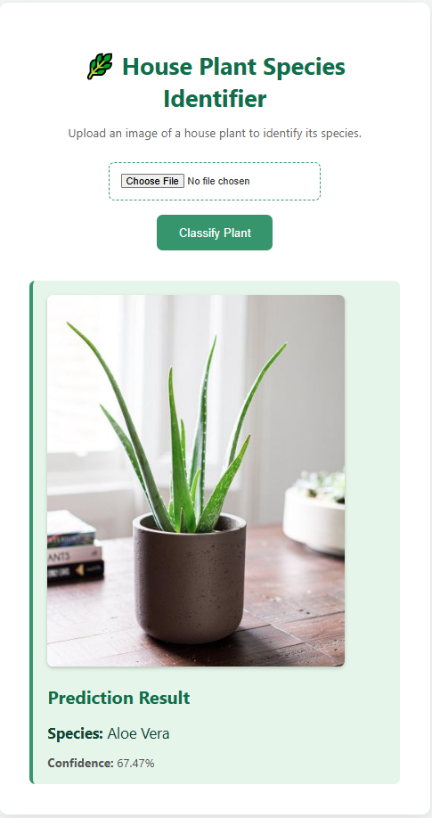

# 🌿 House Plant Species Identifier (Original Monolithic App)


This repository contains the original, monolithic version of the House Plant Species Identifier. It is a complete, standalone Flask application that handles both the machine learning inference and the HTML frontend rendering in a single codebase.

---

### ✨ Project Evolution: Now a Full-Stack Application!

This project was successfully evolved into a modern, decoupled, full-stack application with a separate React frontend and a containerized Python backend. The new version is faster, more scalable, and features a significantly improved user interface.

<div align="center">
  <h4>New Full-Stack Version</h4>
  
</div>

#### 🔗 **Explore the Full-Stack Version:**

| Link                               | URL                                                                                                         |
| :--------------------------------- | :---------------------------------------------------------------------------------------------------------- |
| 🚀 **Live Demo**                   | **[house-plant-frontend.vercel.app](https://house-plant-frontend-3vsr32tzq-md-ehsanul-haque-kanans-projects.vercel.app/)** |
| 🎨 **Frontend Repository (React)** | [github.com/MdEhsanulHaqueKanan/house-plant-frontend](https://github.com/MdEhsanulHaqueKanan/house-plant-frontend) |
| ⚙️ **Backend API Repository (Flask)** | [github.com/MdEhsanulHaqueKanan/house-plant-api](https://github.com/MdEhsanulHaqueKanan/house-plant-api)       |

**Note on Live Demo:** The backend API is hosted on Hugging Face's free community tier. If the app has been inactive, it may "sleep" to save resources. Your first prediction might take **30-90 seconds** as the server wakes up. Subsequent predictions will be much faster!

---

## Demo (of this Original Monolithic Version)



---

## Table of Contents

- Key Features
- Technology Stack
- System Architecture
- Model Details
- Results
- Local Setup & Installation (for this monolithic version)

---

## Key Features (of this Original Version)

*   **Image-Based Classification**: Users can upload an image (`.jpg`, `.png`, etc.) of a house plant.
*   **Instant Predictions**: The application returns the predicted species name along with a confidence score.
*   **Monolithic UI**: A clean, functional interface built with Flask and server-side rendered HTML/CSS.
*   **Efficient Backend**: The Flask server handles file uploads and model inference efficiently.
*   **Custom-Trained Deep Learning Model**: Utilizes a fine-tuned `EfficientNet-B0` model for accurate and fast predictions.

---

## Technology Stack

This project integrates a variety of modern technologies for web development and machine learning:

*   **Backend**: **Python**, **Flask**
*   **Machine Learning**: **PyTorch**, **Torchvision**
*   **Frontend**: **HTML5**, **CSS3**
*   **Core Python Libraries**: **Pillow** (for image manipulation), **NumPy**

---

## System Architecture (Monolithic)

The application follows a simple yet robust client-server architecture:

1.  **Frontend (Client-Side)**: A user accesses the web interface, built with HTML and styled with CSS, and uploads an image via a form.
2.  **Backend (Server-Side - Flask)**:
    *   A Flask route (`/`) receives the `POST` request containing the image file.
    *   The image is read into memory as bytes.
    *   The image bytes are passed to the prediction module.
3.  **Machine Learning Model (PyTorch)**:
    *   The `model.py` utility loads the trained `EfficientNet-B0` model into memory once at application startup to ensure low latency for subsequent predictions.
    *   The uploaded image is preprocessed (resized, normalized, and converted to a tensor) to match the model's input requirements.
    *   The model performs inference on the preprocessed image.
    *   The highest probability output is identified and mapped to its corresponding class name.
4.  **Response**: The predicted species and confidence score are sent back to the Flask backend, which then renders the `index.html` template to display the results to the user.

---

## Model Details

*   **Model**: `EfficientNet-B0`
*   **Framework**: PyTorch
*   **Training**: This model is not pre-trained. The `house_plant_classifier_v1.pth` weights are the result of a complete training process executed from scratch on a Kaggle GPU. This involved data augmentation and writing the full PyTorch training/validation loop to fine-tune the model. The entire end-to-end process is documented in the [Kaggle Notebook](./notebook/house-plant-identification.ipynb) included in this repository.
*   **Classes**: The model is capable of identifying **47 different species** of common house plants. See `class_names.txt` for the full list.

---

## Results 📈

Our machine learning model was trained to identify various house plant species. The complete training and evaluation process is documented in the [Kagle Notebook](./notebook/house-plant-identification.ipynb).

### Summary of Model Performance

After training for 10 epochs, the model achieved the following key performance metrics on the test dataset:

* **Overall Accuracy:** **82%**
* **Final Validation Loss (from training logs):** 0.6232
* **Final Training Loss (from training logs):** 0.4358

### Detailed Classification Report (Test Set)

| Metric       | Precision | Recall | F1-Score | Support |
| :----------- | :-------- | :----- | :------- | :------ |
| **Macro Avg** | **0.82** | **0.82** | **0.81** | **1478**|
| **Weighted Avg** | **0.83** | **0.82** | **0.82** | **1478**|

---

## Local Setup & Installation (for this Monolithic Version)

To run this **original monolithic application** on your local machine, please follow these steps:

**Prerequisites:**
*   Python 3.9 or higher
*   `pip` package installer

**1. Clone the Repository**
```bash
git clone https://github.com/MdEhsanulHaqueKanan/house-plant-species-identifier-machine-learning-flask-app.git
cd house-plant-species-identifier-machine-learning-flask-app
```

**2. Create and Activate a Virtual Environment**

*On Windows:*
```bash
python -m venv venv
.\venv\Scripts\activate
```

*On macOS/Linux:*
```bash
python3 -m venv venv
source venv/bin/activate
```

**3. Install Dependencies**
```bash
pip install -r requirements.txt
```

**4. Download the Model File**
The pre-trained model weights (`house_plant_classifier_v1.pth`) are not tracked by Git. You must download it manually and place it in the `models/` directory for the application to work correctly.

**[Download the model file from Google Drive here](https://drive.google.com/file/d/1qAICG_FhkrZAnGURVBRlp3KFsAgQ092t/view?usp=sharing)**

**5. Run the Application**
```bash
flask run
```

The application will be available at `http://127.0.0.1:5000` in your web browser.

---

## Future Enhancements

*   **Plant Care Information**: Upon successful identification, provide users with basic care tips for the predicted plant species (e.g., watering frequency, light requirements).
*   **REST API**: Expose the prediction logic as a RESTful API endpoint for other applications to consume.
*   **Cloud Deployment**: Deploy the application to a cloud platform like Heroku, AWS Elastic Beanstalk, or Google Cloud Run for public access.
*   **CI/CD Pipeline**: Implement a continuous integration and deployment pipeline using GitHub Actions to automate testing and deployment.

---

Developed by Md. Ehsanul Haque Kanan
